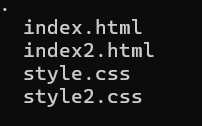

# Netflix y Zafari
Realización de dos páginas con animación.

## Descripción
Las dos páginas web se enfocan en ayudranos a manejas y clonar las páginas de netflix y zafari:

1. La primera es la página de netflix la cual la N tiene la animación.
2. La segunda es la página de zafari es una brujula que se mueve al pasar el mouse.

## Tecnologías utilizadas
* HTML.
* CSS.

## Estructura del proyecto

Aquí podras observar lo utilizado para llevar a cabo el proyecto:

Las páginas se enfocan en la animación.

## Caracteristícas
* Archivos [index.html]:Los cuales contienen el código principal.
* Archivos [style.css]:Nos permite llevar a cabo la realización del diseño del proyecto.

## Diseño
* Se realiza el diseño responsive con el fin de que las páginas puedan ser utilizadas en varios dispositivos.

## Instrucciones
1. clonar el repositorio cargado en GitHub.
2. Abrir en la nube el archivo de HTML. 

## Desarrollado por
El proyecto fue realizado por Yessica Andrea Perez Machuca estudiante de Campuslands como trabajo de refuerzo del día 3.
